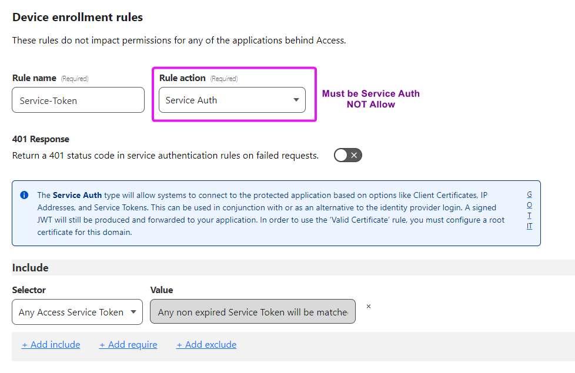

# setup-cloudflare-warp


The `Boostport/setup-cloudflare-warp` action sets up Cloudflare WARP in your GitHub Actions workflow. It allows GitHub
Actions workflows to access resources that are secured by Cloudflare Zero Trust.

## Usage
This action currently only supports Linux, macOS and Windows. Contributions to support Microsoft Windows are welcome.

To use this action, generate a service token using these
[instructions](https://developers.cloudflare.com/cloudflare-one/identity/service-tokens/) and configure the action:

Example:
```yaml
uses: Boostport/setup-cloudflare-warp@v1
with:
  organization: your-organization
  auth_client_id: ${{ secrets.CLOUDFLARE_AUTH_CLIENT_ID }}
  auth_client_secret: ${{ secrets.CLOUDFLARE_AUTH_CLIENT_SECRET }}
```
You can specify the version of Cloudflare WARP to install:
```yaml
uses: Boostport/setup-cloudflare-warp@v1
with:
  version: 2023.1.133
  organization: your-organization
  auth_client_id: ${{ secrets.CLOUDFLARE_AUTH_CLIENT_ID }}
  auth_client_secret: ${{ secrets.CLOUDFLARE_AUTH_CLIENT_SECRET }}
```

## Inputs
- `version` - (optional) The version of Cloudflare WARP to install. Defaults to the latest version.
- `organization` - (required) The name of your Cloudflare Zero Trust organization.
- `auth_client_id` - (required) The service token client id.
- `auth_client_secret` - (required) The service token client secret.
- `configure_docker_dns` - (optional) *Linux Only* Configure Docker to use Cloudflare WARP for DNS resolution. Defaults to `false`.

## Cloudflare Permissions
> [!TIP]
> Failure to set the proper permission will result in a `Status update: Unable to connect. Reason: Registration Missing` error.

Under `Zero Trust > Settings > WARP Client > Device enrollment permissions` a policies rule must have `SERVICE AUTH` set as the rule action.


To add the GitHub action to a WARP Client Profile, you must specify the expression of the policy to `User Email`, `is`, `non_identity@<INSERT YOUR ORG>.cloudflareaccess.com`.


## Troubleshooting
- Unable to connect: `Status update: Unable to connect. Reason: Registration Missing` errors
  - Check that the service token is valid and not expired.
  - Check that the service token has the appropriate permissions to connect.
  - Cancel and restart the job, sometimes there's an issue on Cloudflare's end that causes this error.

## Disclaimer
This is not an official Cloudflare product nor is it endorsed by Cloudflare.