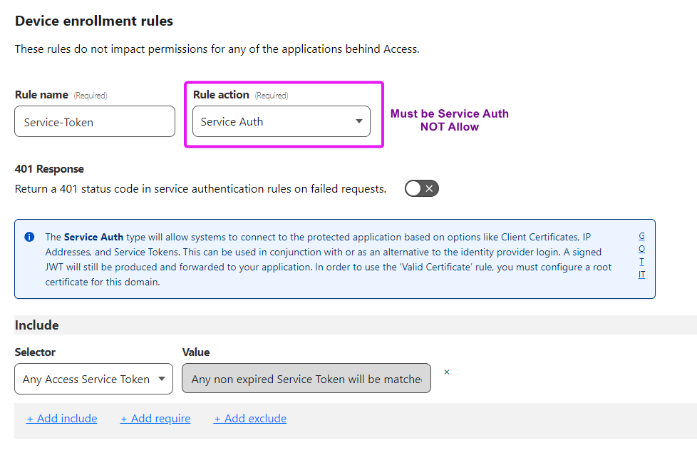

# setup-cloudflare-warp


The `Boostport/setup-cloudflare-warp` action sets up Cloudflare WARP in your GitHub Actions workflow. It allows GitHub
Actions workflows to access resources that are secured by Cloudflare Zero Trust.

## Usage
This action currently only supports Linux, macOS and Windows. Contributions to support Microsoft Windows are welcome.

To use this action, generate a service token using these
[instructions](https://developers.cloudflare.com/cloudflare-one/identity/service-tokens/) and configure the action:

Example:
```yaml
uses: Boostport/setup-cloudflare-warp@v1
with:
  organization: your-organization
  auth_client_id: ${{ secrets.CLOUDFLARE_AUTH_CLIENT_ID }}
  auth_client_secret: ${{ secrets.CLOUDFLARE_AUTH_CLIENT_SECRET }}
```
You can specify the version of Cloudflare WARP to install:
```yaml
uses: Boostport/setup-cloudflare-warp@v1
with:
  version: 2023.1.133
  organization: your-organization
  auth_client_id: ${{ secrets.CLOUDFLARE_AUTH_CLIENT_ID }}
  auth_client_secret: ${{ secrets.CLOUDFLARE_AUTH_CLIENT_SECRET }}
```

You can also specify a unique client identifier for the device:
```yaml
uses: Boostport/setup-cloudflare-warp@v1
with:
  organization: your-organization
  auth_client_id: ${{ secrets.CLOUDFLARE_AUTH_CLIENT_ID }}
  auth_client_secret: ${{ secrets.CLOUDFLARE_AUTH_CLIENT_SECRET }}
  unique_client_id: bc6ea6f6-a7c9-4da0-b303-69f5481803b8
```

You can also specify virtual network you want to use:
```yaml
uses: Boostport/setup-cloudflare-warp@v1
with:
  organization: your-organization
  auth_client_id: ${{ secrets.CLOUDFLARE_AUTH_CLIENT_ID }}
  auth_client_secret: ${{ secrets.CLOUDFLARE_AUTH_CLIENT_SECRET }}
  vnet: ${{ secrets.CLOUDFLARE_VNET }}
```

On Linux, you can configure Docker to resolve DNS through Cloudflare WARP. If Docker's default address ranges
(`172.17.0.0/16` for the default bridge, and the ranges used for user-defined networks) overlap with networks routed
through your Zero Trust organization, use `docker_bip` to move the default bridge (the DNS resolver IP is derived
from it) and `docker_default_address_pools` to move user-defined networks (e.g. those created by Docker Compose):
```yaml
uses: Boostport/setup-cloudflare-warp@v1
with:
  organization: your-organization
  auth_client_id: ${{ secrets.CLOUDFLARE_AUTH_CLIENT_ID }}
  auth_client_secret: ${{ secrets.CLOUDFLARE_AUTH_CLIENT_SECRET }}
  configure_docker_dns: true
  docker_bip: 192.168.200.1/24
  docker_default_address_pools: 192.168.204.0/22,24
```

> [!NOTE]
> `docker_default_address_pools` only affects networks created after this action runs, such as networks created by
> `docker compose` or `docker network create` in later steps. Job containers (`container:`) and service containers
> (`services:`) run on networks created before workflow steps execute, so this action cannot change their subnets;
> that requires Docker daemon configuration at runner provisioning time.

## Inputs
- `version` - (optional) The version of Cloudflare WARP to install. Defaults to the latest version.
- `organization` - (required) The name of your Cloudflare Zero Trust organization.
- `auth_client_id` - (required) The service token client id.
- `auth_client_secret` - (required) The service token client secret.
- `unique_client_id` - (optional) A unique identifier for the client device. See [Cloudflare documentation](https://developers.cloudflare.com/cloudflare-one/connections/connect-devices/warp/deployment/mdm-deployment/parameters/#unique_client_id) for more details.
- `configure_docker_dns` - (optional) *Linux Only* Configure Docker to use Cloudflare WARP for DNS resolution. Defaults to `false`.
- `docker_bip` - (optional) *Linux Only* Bridge IP for the default Docker network in CIDR notation (e.g. `192.168.200.1/24`). Sets the `bip` in the Docker daemon configuration and uses its address as the DNS resolver IP instead of `172.17.0.1`. Requires `configure_docker_dns` to be enabled.
- `docker_default_address_pools` - (optional) *Linux Only* Address pools for Docker user-defined networks, as one or more `<base-cidr>,<subnet-size>` pairs separated by semicolons (e.g. `192.168.204.0/22,24` or `192.168.204.0/22,24;10.99.0.0/16,24`). Sets `default-address-pools` in the Docker daemon configuration. Only affects networks created after this action runs. Requires `configure_docker_dns` to be enabled.
- `vnet` - (optional) Virtual network ID

## Cloudflare Permissions
> [!TIP]
> Failure to set the proper permission will result in a `Status update: Unable to connect. Reason: Registration Missing` error.

Under `Zero Trust > Settings > WARP Client > Device enrollment permissions` a policies rule must have `SERVICE AUTH` set as the rule action.


To add the GitHub action to a WARP Client Profile, you must specify the expression of the policy to `User Email`, `is`, `non_identity@<INSERT YOUR ORG>.cloudflareaccess.com`.


## Troubleshooting
- Unable to connect: `Status update: Unable to connect. Reason: Registration Missing` errors
  - Check that the service token is valid and not expired.
  - Check that the service token has the appropriate permissions to connect.
  - Cancel and restart the job, sometimes there's an issue on Cloudflare's end that causes this error.

## Disclaimer
This is not an official Cloudflare product nor is it endorsed by Cloudflare.
